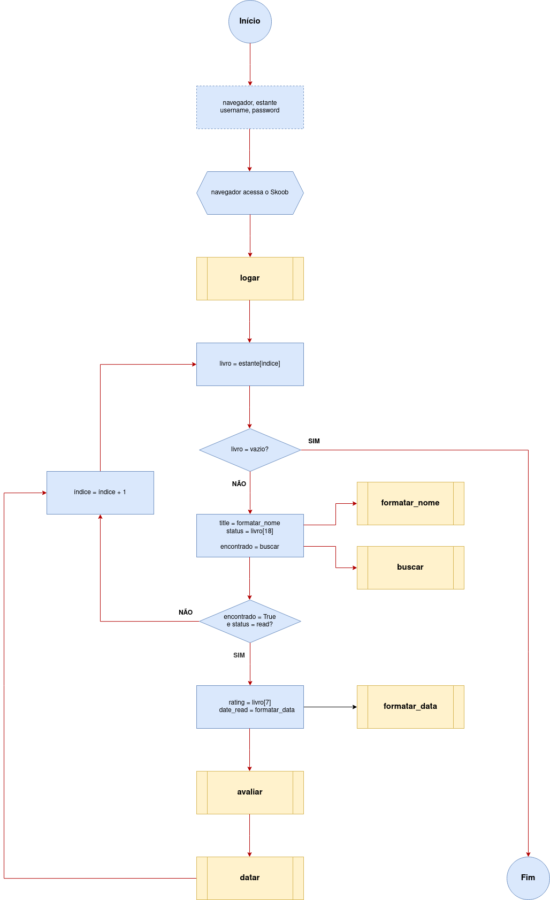

# GOODSKOOB
<fig>  </fig>

## :scroll: Introdução

> Programa com o objetivo principal de automatizar o processo de avaliar e classificar grande quantidade de livros do site Goodreads para o Skoobs. O projeto foi pensado para usuários familiarizados com Python.

## :pencil2: Ferramentas

- [**Python**](https://www.python.org/) - Linguagem de programação utilizada;
- [**Selenium**](https://www.selenium.dev/) - Ferramenta para automatizar tarefas em navegadores;
- [**Firefox**](https://www.mozilla.org/pt-BR/firefox/new/) - Navegador utilizado para acesso aos sites;
- [**Goodreads**](https://www.goodreads.com) - Site para download do arquivo csv com as informações dos livros;
- [**Skoob**](https://www.skoob.com.br) - Site para cadastrar os livros exportados do Goodreads

## :memo: Inicialização

- **EXPORTAR LIVROS**
	- Acessar o site **Goodreads** no navegador e fazer login;
	- Clicar em "My Books";
	- Na seção "Tools", da coluna no lado direito, clicar em "Import and export";
	- Clicar no botão "Export library" e aguardar;
	- Quando aparecer, clicar em "Your export from DD/MM/AAAA - HH:MM" para baixar o arquivo "goodreads_library_export.csv" com as informações de leitura;

- **CONFIGURAR DO PROGRAMA**
	- Abrir o arquivo "goodreads_library_export.csv", apagar a primeira linha (cabeçalho) e salvar as alterações no diretório do programa;
	- Abrir o arquivo "goodskoob.py";
	- Na linha 6, atribuir à variável **"navegador"** a função do seu navegador. EX.: webdriver.Chrome(), webdriver.Safari();
	- Nas linhas 16 e 17, atribuir as variáveis **"username"** e **"password"** seu usuário e senha (dentro das aspas). EX.: username = "email@fulano.com", password = "uva321pera";
	- Salvar as alterações;

- Executar o arquivo "goodskoob.py";

## :bookmark_tabs: Funcionamento do programa
<fig>  </fig>

## :pushpin: Contato

